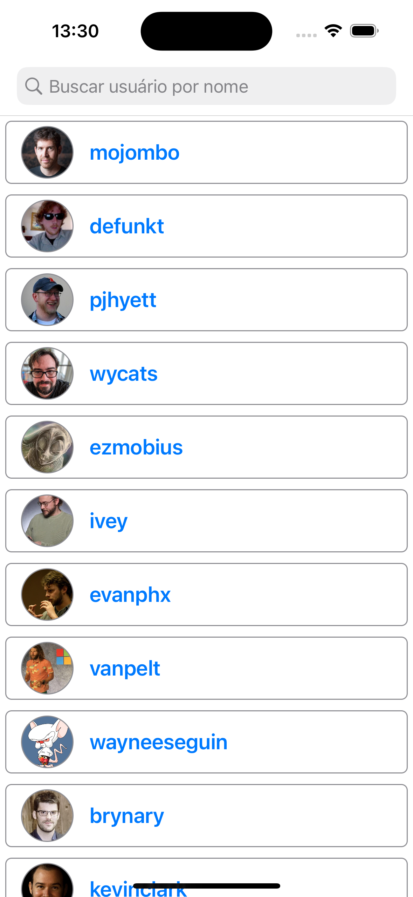
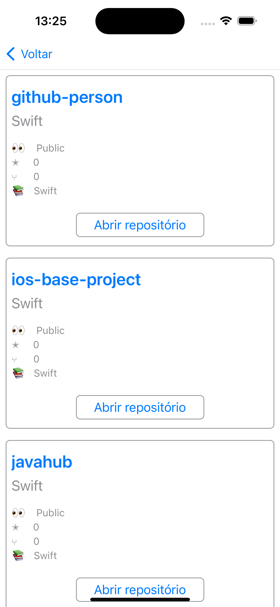
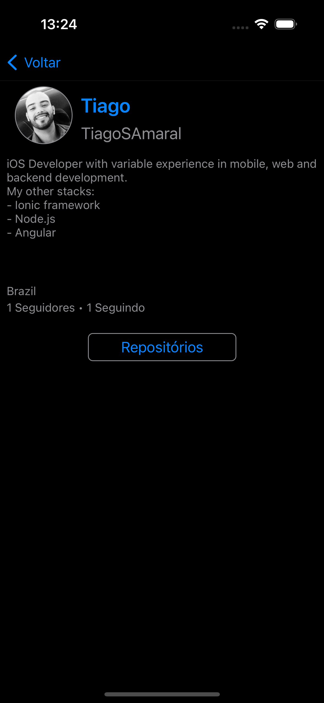
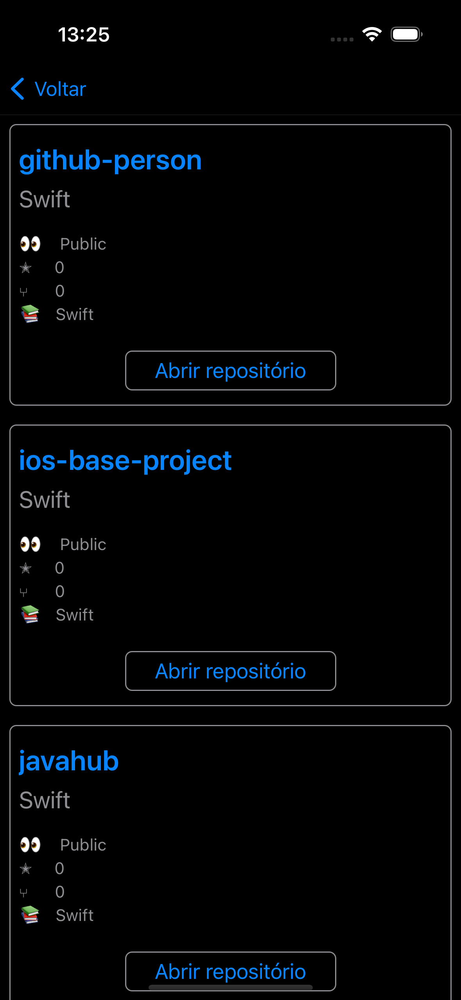

# Github Person

Aplicativo de laboratório. Ele consome a API do github para listar, buscar usuários. Também permite buscar dados somente de um usuário selecionado, e listar seus repositório, e também permite ver os dados do repositório.

Descricão simples:
- Tela lista usuários: 
    Permite buscar usuários.
- Tela dados usuário: 
    Expões alguns dados públicos do usuário selecionado
- Tela repositórios: 
    Lista os dados do repositório e permite veisualiza-lo pelo SafarieService dentro do app.

Suporte a Darkmode

## Preview

#### Light Mode
<p float="left">
<kbd></kbd>
<kbd></kbd>
<kbd></kbd>
<kbd></kbd>
<kbd></kbd>

#### Dark Mode
<p float="left">
<kbd></kbd>
<kbd></kbd>
<kbd></kbd>
<kbd></kbd>
<kbd></kbd>
</p>

## Sobre o projeto: <br>
- Xcode Version 14.2 ou superior<br>
- Suporte mínimo ao iOS 13.6+<br>
- Swift 5<br>
- Cobertura de Código: 53.88%

### Ferramentas de Gestão e Qualidade de Código
- Fastlane
- XCov
- Jazzy
- Swiftlint

### Gerenciador de Dependências
- Swift Package Manager

### Dependências:
- [Kingfisher](https://github.com/onevcat/Kingfisher)
- [Alamofire](https://github.com/Alamofire/Alamofire)

---
<br>

## Preparando o Ambiente

Para executar o projeto, siga os passos abaixo.

Foi utilizado a versão do Ruby 2.7.0 no uso das ferramentas de gestão e qualidade.

### [RVM](https://rvm.io/)

Instale o RVM com o seguinte comando: <br>

```\curl -sSL https://get.rvm.io | bash -s stable```

Após a instalação, utilize o seguinte comando para usar a versão 2.7.0 do Ruby:

```
rvm install 2.7.0
```

Depois use o comando: <br>
```
rvm use 2.7.0
```

### [BREW](https://brew.sh/)

Instale o brew com o seguinte comando: <br>

```
/usr/bin/ruby -e "$(curl -fsSL https://raw.githubusercontent.com/Homebrew/install/master/install)"
```

---
<br>

## Instalando dependencias de Gestão

Após instalados o Brew e o RVM execute os seguintes comandos

```shell
brew bundle
```

```shell
bundle install
```

Irá instalar as dependencias listadas no arquivo `Brewfile` e `Gemfile` respectivamente.

---
<br>

### Instalação de Dependências do Projeto

Agora abra o Xcode e atualize as dependencias usando o Swift Package Manager.

---
<br>

### Fastlane

Usado para automatizar tarefas como execucao de testes unitários, assinatura projetos e envio para Loja e Testflight.

No projeto, já possi alguns lanes básicos configurados. Para usa-los, execute um dos comandos abaixo:

- Check code style<br>
```fastlane ios lint_code```

- Create coverage report<br>
```fastlane ios coverage```

- Used by Development to keep code quality.<br>
```fastlane ios check_code``` ou ```fastlane check_code dev:true```

Ver mais no link: [Fastlane](https://fastlane.tools)

### Jazzy

Ferramenta para documentação de código

Ver mais no link: [Realm/jazzy](https://github.com/realm/jazzy)

### Xcov

Ferramenta para exibir de forma mais amigável informações de cobertura de código do projeto.

Ver mais no link: [Xcov](https://github.com/fastlane-community/xcov)